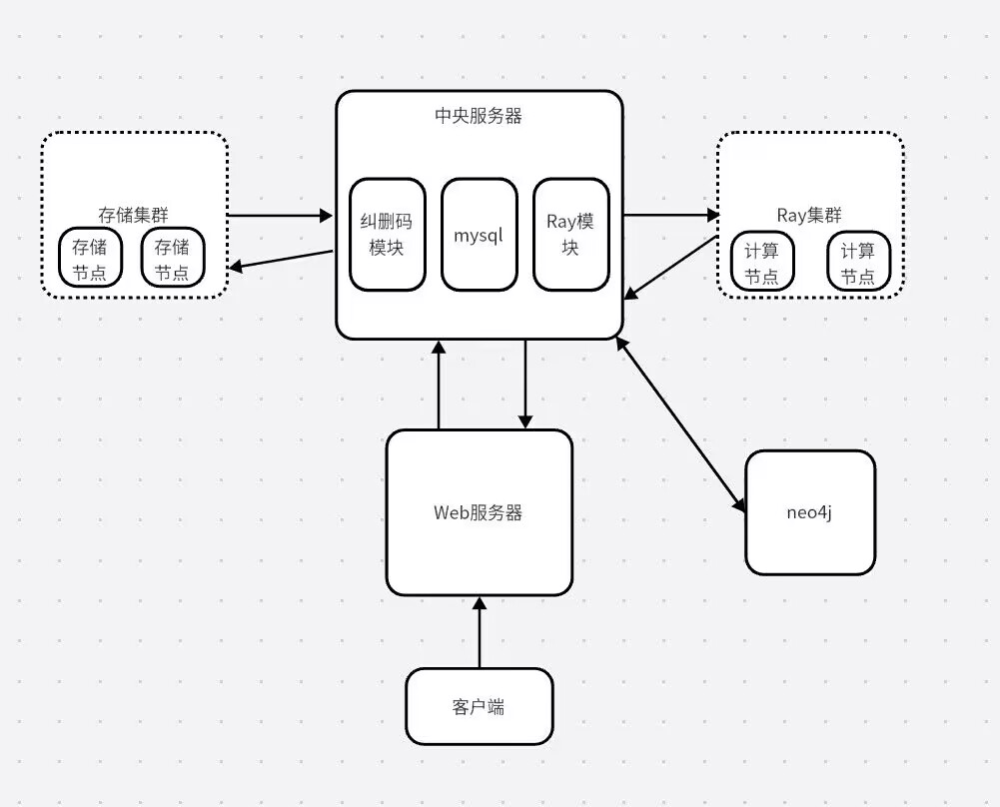
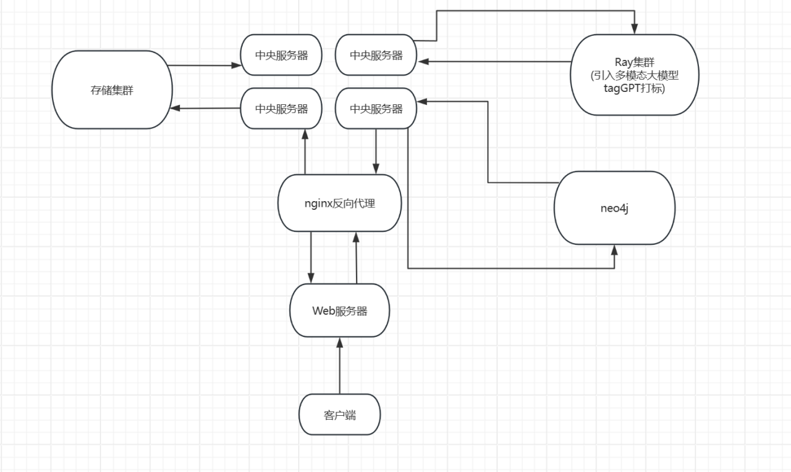

# 2024.3.24 会议记录
## PART 1 讨论选题
#### 待定方向：
 - 在已有的图文件项目上，引入大模型对打标方式进行优化，从而实现多模态
 - 利用nginx实现反向代理，从而把GFS中的MainServer变成分布式
 - 树莓派？
#### nginx介绍
1. nginx是什么
> Nginx（发音同“engine X”）是异步框架的网页服务器，也可以用作反向代理、负载平衡器和HTTP
缓存。该软件由俄罗斯程序员伊戈尔·赛索耶夫（Игорь Сысоев）开发并于2004年首次公开发
布。2011年成立同名公司以提供支持服。2019年3月11日，Nginx公司被F5网络公司以6.7亿美元
收购。Nginx是免费的开源软件，根据类BSD许可证的条款发布。一大部分Web服务器使用
Nginx，通常作为负载均衡器。
2. nginx的特点
>Nginx可以部署在网络上使用FastCGI脚本、SCGI处理程序、WSGI应用
>服务器或Phusion Passenger
>模块的动态HTTP内容，并可作为软件负载均衡器。Nginx使用异步事件驱动的方法来处理请求。
Nginx的模块化事件驱动架构可以在高负载下提供更可预测的性能。Nginx是一款面向性能设计的
HTTP服务器，相较于Apache、lighttpd具有占有内存少，稳定性高等优势。与旧版本（≤2.2）的
Apache不同，Nginx不采用每客户机一线程的设计模型，而是充分使用异步逻辑从而削减了上下
文调度开销，所以并发服务能力更强。整体采用模块化设计，有丰富的模块库和第三方模块库，
配置灵活。在Linux操作系统下，Nginx使用epoll事件模型，得益于此，Nginx在Linux操作系统下效率相当高。同时Nginx在OpenBSD或FreeBSD操作系统上采用类似于epoll的高效事件模型
kqueue。
#### 讨论结果
- 树莓派相关没有想到具体的计算任务，遂放弃
- 对图文件系统讨论后，经询问老师，觉得可行
- 原来小组项目架构

$~$
- 利用nginx实现反向代理的项目模式架构(忽略箭头)

- **多模态实现思路**：利用大模型**tagserver**进行打标操作
#### 未来一周计划
- 创建一个项目小组
- 做调研报告：对项目背景，立项依据，重要性、前瞻性分析，相关工作进行调研，一人负责整合，下周六前完成
#### 相关资料
- 关于nginx的介绍：https://cloud.tencent.com/developer/article/1418457
- 关于tagserver的论文：https://arxiv.org/format/2304.03022
- 关于多模态的介绍：https://zhuanlan.zhihu.com/p/682893729
- OSH-2023-My-Glow:https://github.com/OSH-2023/My-Glow

