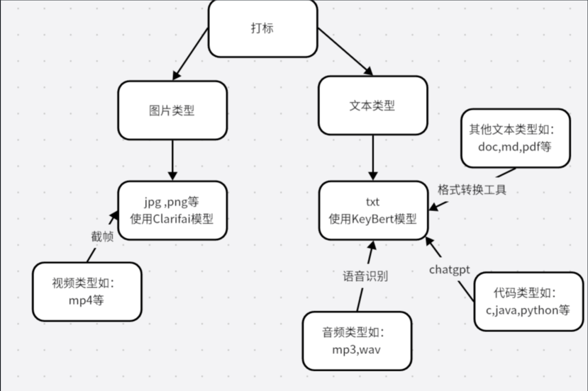
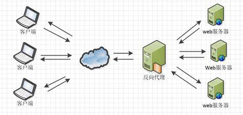
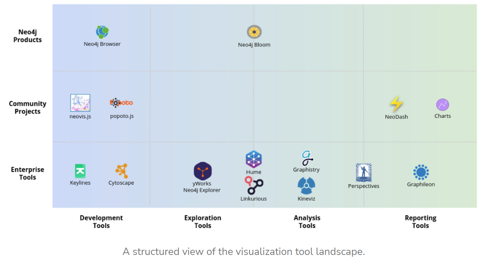
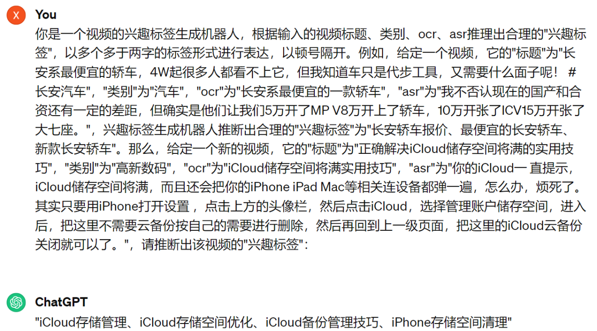

# 可行性报告
## 目录
- [可行性报告](#可行性报告)
  - [目录](#目录)
  - [项目介绍](#项目介绍)
  - [创新点](#创新点)
    - [往年小组项目情况](#往年小组项目情况)
      - [x-DisGraFS 小组：](#x-disgrafs-小组)
      - [x-TOBEDONE 小组](#x-tobedone-小组)
      - [MyGlow 小组：](#myglow-小组)
      - [本组创新方向](#本组创新方向)
        - [引入大模型统一打标索引](#引入大模型统一打标索引)
        - [分布式处理MainServer](#分布式处理mainserver)
  - [理论依据](#理论依据)
    - [打标问题](#打标问题)
      - [可选大模型](#可选大模型)
    - [nginx反向代理](#nginx反向代理)
      - [简介](#简介)
      - [反向代理](#反向代理)
      - [反向代理优势](#反向代理优势)
      - [反向代理应用](#反向代理应用)
  - [技术依据](#技术依据)
    - [Nginx](#nginx)
        - [简介](#简介-1)
        - [反向代理](#反向代理-1)
        - [负载均衡](#负载均衡)
    - [Neo4j](#neo4j)
    - [TagGPT](#taggpt)
  - [技术路线](#技术路线)
## 项目介绍
本项目是基于2023年My-Glow小组项目的优化，主要针对图文件系统中多模态数据的打标问题和中央服务器的负载均衡问题，尝试引入大模型简化打标流程，并尝试利用反向代理优化中央服务器，从而使得该图文件系统可以更好地支持不同格式的文件并拥有更好的性能。

## 创新点

### 往年小组项目情况

#### x-DisGraFS 小组：
- x-DisGraFS小组构建了分布式图文件系统，采用Neo4j的图数据库，并且采用分布式存储，和Ray进行分布式计算打标的框架，初步实现图文件系统。

- 它的远程存储集群并没有真正搭建起来，DisGraFS 实际的实现中要求用户要将存储节点挂载到本地，形成一个所谓的客户端，这一项增加了用户的使用难度。
  
#### x-TOBEDONE 小组
- 复用了 dontpanic 的纠删码文件切片设计，改进了多用户隔离，在网页端引入共享、删除、重命名等文件操作，引入了文件夹操作，通过 vpn 搭建 Ray 集群，引入了监控模块，监控数据图形可视化，运维工作者可以远程唤醒或关闭存储节点。用户的所有操作均在网页端进行。我们也实现了多个模块的容器化部署 

#### MyGlow 小组：

- 重新搭建了整个分布式框架，并解决了数据一致性问题，提高了系统的鲁棒性。重写了前端和可视化，实现了更好的用户体验。
- 此外，通过更新ray打标的大模型，他们提高了图文件系统的准确性和效率。

#### 本组创新方向
通过对往年小组的分析，我们发现，往年小组的中央服务器并未实现分布式，其中一个或多个主服务器负责管理文件的存储和访问。这种架构存在一些局限性，例如单点故障、性能瓶颈和可扩展性差等。故本组想要分布式处理中央服务器并实现反向代理，从而优化负载均衡问题。并且，优化打标框架，从而更好地支持多种文件格式。

##### 引入大模型统一打标索引

传统分布式文件系统往往只能依靠文件的元数据进行索引和查询，无法直接理解文件的内容语义。而我们小组提出利用现成的大模型进行文件标记和索引，可以更准确地理解和描述文件的内容，从而提高检索的准确性和效率。这种多模态大模型统一索引的方法是一种全新的思路，将人工智能技术与分布式文件系统相结合，为文件管理和检索带来了更加智能化和高效化的解决方案。

##### 分布式处理MainServer

>传统分布式文件系统通常将主服务器作为单一的节点，负责管理所有的文件存储和访问请求。这种架构存在单点故障和性能瓶颈等问题。我们小组提出使用Nginx作为反向代理，将主服务器内容部署到分布式集群中，从而实现了主服务器的分布式部署。这种优化方案可以提高系统的性能和可用性，还可以增强系统的安全性，减少单点故障的风险。

将分布式文件系统的mainserver优化为分布式。可以使用nginx作为反向代理将分布式文件系统的主服务器内容部署到分布式集群中，提高性能、可用性和安全性

- **分布式部署**： 
将原本集中式的主服务器转变为分布式部署的形式。
- **Nginx反向代理**：
在原有项目基础上配置nginx反向代理工具，从而在处理用户请求时，可以进行合理分配，降低但带你故障的风险。

## 理论依据

### 打标问题
原有小组的打标模型


可知存在以下问题：
1. 在打标过程中需要对不同的类型进行分类，从而采用不同的处理方法，框架繁多。
2. 对于视频类型，需要截帧形成图片，对于非txt类型的文本文件，需要进行格式转换，操作繁琐，容易丢失原有信息。

所以需要一个统一处理的模型，理想情况下，使用该模型可以简化打标过程。
#### 可选大模型
**LangChain**
**简介**

LangChain是一个基于语言模型开发应用程序的框架。它可以实现以下应用程序：

- 数据感知：将语言模型连接到其他数据源
- 自主性：允许语言模型与其环境进行交互

LangChain的主要价值在于：

- 组件化：为使用语言模型提供抽象层，以及每个抽象层的一组实现。组件是模块化且易于使用的，无论您是否使用LangChain框架的其余部分
- 现成的链：结构化的组件集合，用于完成特定的高级任务

**关键组件解释**

**Prompts**

Prompts用来管理 LLM 输入的工具，在从 LLM 获得所需的输出之前需要对提示进行相当多的调整，最终的Prompts 可以是单个句子或多个句子的组合，它们可以包含变量和条件语句。

**Chains**

是一种将LLM和其他多个组件连接在一起的工具，以实现复杂的任务。

**Agents**

是一种使用LLM做出决策的工具，它们可以执行特定的任务并生成文本输出。Agents通常由三个部分组成：Action、Observation和Decision。Action是代理执行的操作，Observation是代理接收到的信息，Decision是代理基于Action和Observation做出的决策。

**Memory**

是一种用于存储数据的工具，由于LLM 没有任何长期记忆，它有助于在多次调用之间保持状态。

**应用方向**

1、[川虎 Chat Chuanhu Chat](https://github.com/GaiZhenbiao/ChuanhuChatGPT)

该GitHub仓库为ChatGPT和其他语言模型提供了一个易于使用的Web图形界面，并提供了许多附加功能，使用户能够更方便地与语言模型进行交互，并根据自己的需求进行定制和管理。

2、[AudioGPT](https://github.com/AIGC-Audio/AudioGPT)

该仓库的创新点在于提供了一个集成了多种语音、音频和虚拟人物处理功能的开源实现。它使用了多个基础模型，并提供了预训练模型和示例代码，使用户能够快速开始使用这些功能。此外，该仓库还致力于不断增加更多的支持模型和任务，以进一步扩展其功能。

3、[GPT-Migrate](https://github.com/joshpxyne/gpt-migrate)

GPT-Migrate是一个功能强大且具有创新性的工具，可以帮助用户轻松地将代码库从一个框架或语言迁移到另一个框架或语言。该项目使用了大规模语言模型（LLM）来辅助代码迁移过程，可以减少手动迁移的工作量和错误。并减少了迁移过程中的工作量和错误。

4、[SalesGPT](https://github.com/filip-michalsky/SalesGPT)

SalesGPT是一个上下文感知的AI销售助手，具有工具支持和对话阶段理解的能力，旨在帮助构建自主销售代理。它通过访问产品知识库和根据对话阶段的不同做出相应的回应，提供了更准确和个性化的销售对话体验。

**TAGGPT**

**要点**

- 动机：标签在当代互联网应用中非常重要，如搜索引擎和推荐系统，而大型语言模型在多项任务中显示出令人印象深刻的能力，TagGPT旨在利用这些能力实现自动多模态标签提取和标记。
- 方法：通过精心设计的提示语，利用预训练大型语言模型提取和推理有关多模态数据的正确标签，TagGPT通过从原始数据中预测大规模候选标签，过滤语义和频率，自动构建高质量标签集合，为特定应用提供标签。对于需要标记分发的新实体，TagGPT提供两种零样本标记替代方案：一种是在标签集合中进行后期语义匹配的生成式方法，另一种是在提示中进行早期匹配的选择性方法。
- 优势：TagGPT是一种具有模块化框架的系统级解决方案，具有适用于现代社交媒体中各种数据形式的强大泛化能力。可以提供完整的标签系统构建和标记模型工具，并且可无缝地替换为任何更高级别的模型。实验结果表明，TagGPT的标记效果比现有的哈希标签和现成的标记器都要好。

**Github链接**

[TencentARC-QQ/TagGPT: TagGPT: Large Language Models are Zero-shot Multimodal Taggers (github.com)](https://github.com/TencentARC-QQ/TagGPT)

**总结**

TagGPT 是基于预训练大型语言模型和句嵌入模型提出的一种全自动零样本系统 ，用于在多媒体数据中提取和标记标签。

**anythingLLM**
**简介**

**AnythingLLM** 是 Mintplex Labs Inc. 开发的一款开源 ChatGPT 等效工具，用于在安全的环境中与文档等进行聊天，专为想要使用现有文档进行智能聊天或构建知识库的任何人而构建。

**AnythingLLM 能够把各种文档、资料或者内容转换成一种格式**，让LLM（如ChatGPT）在聊天时可以引用这些内容。然后你就可以用它来和各种文档、内容、资料聊天，**支持多个用户同时使用，还可以设置谁能看或改哪些内容。** **支持多种LLM、嵌入器和向量数据库。**

**AnythingLLM 特点**

- **多用户支持和权限管理**：允许多个用户同时使用，并可设置不同的权限。
- **支持多种文档类型**：包括 PDF、TXT、DOCX 等。
- **简易的文档管理界面**：通过用户界面管理向量数据库中的文档。
- **两种聊天模式**：对话模式保留之前的问题和回答，查询模式则是简单的针对文档的问答
- **聊天中的引用标注**：链接到原始文档源和文本。
- **简单的技术栈**，便于快速迭代。
- **100% 云部署就绪**。
- **“自带LLM”模式**：可以选择使用商业或开源的 LLM。
- **高效的成本节约措施**：对于大型文档，只需嵌入一次，比其他文档聊天机器人解决方案节省 90% 的成本。
- **完整的开发者 API**：支持自定义集成。

**支持的 LLM、嵌入模型和向量数据库**

- **LLM**：包括任何开源的 llama.cpp 兼容模型、OpenAI、Azure OpenAI、Anthropic ClaudeV2、LM Studio 和 LocalAi。
- **嵌入模型**：AnythingLLM 原生嵌入器、OpenAI、Azure OpenAI、LM Studio 和 LocalAi。
- **向量数据库**：LanceDB（默认）、Pinecone、Chroma、Weaviate 和 QDrant。

**技术概览**

整个项目设计为单线程结构，主要由三部分组成:收集器、前端和服务器。

- **collector**：Python 工具，可快速将在线资源或本地文档转换为 LLM 可用格式。
- **frontend**：ViteJS + React 前端，用于创建和管理 LLM 可使用的所有内容。
- **server**：NodeJS + Express 服务器，处理所有向量数据库管理和 LLM 交互。

### nginx反向代理

#### 简介

Nginx 是一个高性能的开源 Web 服务器和[反向代理](https://so.csdn.net/so/search?q=反向代理&spm=1001.2101.3001.7020)服务器。它具有轻量级、高并发、低内存消耗等特点，被广泛用于搭建静态资源服务器、负载均衡、反向代理等场景。

#### 反向代理

​	反向代理是一种[代理服务器](https://so.csdn.net/so/search?q=代理服务器&spm=1001.2101.3001.7020)的配置模式，它代表服务器向客户端提供服务。客户端发送请求到反向代理服务器，然后反向代理服务器将请求转发到后端的真实服务器上，并将响应返回给客户端。简单理解为用户直接访问反向代理服务器就可以获得目标服务器的资源。这一过程叫反向代理。

　　反向代理和正向代理的区别就是：**正向代理代理客户端，反向代理代理服务器。**

​	反向代理，其实客户端对代理是无感知的，因为客户端不需要任何配置就可以访问，我们只需要将请求发送到反向代理服务器，由反向代理服务器去选择目标服务器获取数据后，在返回给客户端，此时反向代理服务器和目标服务器对外就是一个服务器，暴露的是代理服务器地址，隐藏了真实服务器IP地址。

　　下面通过两张图来对比正向代理和方向代理：


　　理解这两种代理的关键在于代理服务器所代理的对象是什么，正向代理代理的是客户端，我们需要在客户端进行一些代理的设置。而反向代理代理的是服务器，作为客户端的我们是无法感知到服务器的真实存在的。

　　总结起来还是一句话：**正向代理代理客户端，反向代理代理服务器。**

#### 反向代理优势

nginx反向代理的优点有：

- 可以隐藏后端服务器的真实IP地址，提高安全性。
- 可以实现负载均衡，根据不同的算法，将请求分配给不同的后端服务器，提高性能和可用性。
- 可以实现缓存和压缩，减少网络传输和后端服务器的负担。
- 可以实现URL重写和跳转，根据不同的规则，修改或重定向请求和响应。
- 可以实现日志记录和监控，方便分析和调试。

#### 反向代理应用

1. **负载均衡**：Nginx可以作为负载均衡器，将客户端请求分发给多个后端服务器，以提高系统的性能、可用性和可扩展性。通过负载均衡，Nginx可以根据不同的策略（如轮询、IP哈希、最少连接数等）将请求分发给不同的后端服务器。
2. **缓存加速**：Nginx可以缓存静态资源或动态内容，减轻后端服务器的负载并提高用户访问速度。通过在Nginx上设置缓存规则，可以将频繁访问的内容缓存起来，减少对后端服务器的请求次数。
3. **SSL终端**：Nginx可以作为SSL终端，用于处理SSL/TLS连接。通过在Nginx上进行SSL终端处理，可以减轻后端服务器的负载，并提高安全性。
4. **保护后端服务器**：Nginx可以用作防火墙，过滤和限制对后端服务器的访问。通过Nginx的访问控制功能，可以限制特定IP地址、User-Agent、请求方法等的访问，并保护后端服务器免受恶意攻击。
5. **Web应用代理**：Nginx可以代理各种Web应用程序，如Node.js、Python Django、Ruby on Rails等。通过将客户端请求代理到不同的后端应用服务器，可以实现统一的访问入口和负载均衡。
6. **静态文件服务**：Nginx可以直接提供静态文件服务，无需借助后端应用服务器。这种方式可以降低系统的负载，并提高静态文件的访问速度。

## 技术依据
### Nginx
##### 简介
Nginx是一款轻量级的HTTP服务器，采用事件驱动的异步非阻塞处理方式框架，这让其具有极好的IO性能，时常用于服务端的反向代理和负载均衡。  
在安装好Nginx之后，可以使用下面几条命令来启动或停止Nginx
```
nginx           //正常启动
nginx -s quit   //正常关机
nginx -s stop   //快速关机
nginx -s reload //重新加载配置文件
...
```
nginx的默认配置文件如下
``` nginx
server {  
        # 当nginx接到请求后，会匹配其配置中的service模块
        # 匹配方法就是将请求携带的host和port去跟配置中的server_name和listen相匹配
        listen       8080;        
        server_name  localhost; # 定义当前虚拟主机（站点）匹配请求的主机名

        location / {
            root   html; # Nginx默认值
            # 设定Nginx服务器返回的文档名
            index  index.html index.htm; # 先找根目录下的index.html，如果没有再找index.htm
        }
}
```
server{}包含在http{}内部，每一个server{}是一个虚拟主机，上面代码块的意思是：当一个叫做**localhost:8080**的请求请求nginx服务器时，该请求就会被匹配进该代码块的server{}中执行。
##### 反向代理
反向代理时一种位于客户端和后端服务器之间的代理服务器，它可以将请求转发到后端服务器，并将响应返回给客户端，简单来说就是，客户端获得了他需要的内容，但是具体从哪里获得的内容以及获得内容的过程客户端并不知道。  
<!--  -->


下面配置了一个简单的反向代理
``` nginx
server {
        listen       8080;        
        server_name  localhost;

        location / {
            root   html; # Nginx默认值
            index  index.html index.htm;
        }
        
        proxy_pass http://localhost:8000; # 反向代理配置，请求会被转发到8000端口
}
```
这段代码的表现很简单，就是向nginx请求**localhost:8080**跟请求**http://local:8000**是一样的效果。  
如此我们便可以将中心服务器变成分布式，然后使用反向代理，让客户端可以通过反向代理访问多个分布式的主服务器。
##### 负载均衡
在分布式服务器集群中，Nginx可以将接收到的客户端请求近似均匀地分配到这个集群地所有服务器上，这就叫做负载均衡。
配置一个简单的负载均衡如下：
``` nginx
upstream domain {
    server localhost:8000;
    server localhost:8001;
}
server {  
        listen       8080;        
        server_name  localhost;

        location / {
            # root   html; # Nginx默认值
            # index  index.html index.htm;
            
            proxy_pass http://domain; # 负载均衡配置，请求会被平均分配到8000和8001端口
            proxy_set_header Host $host:$server_port;
        }
}
```
负载均衡成功后可以看到访问**localhost:8080**有时候会访问到8000端口的页面，有时会访问到8001端口的页面，而且这里请求会被平均分配到两个端口，还可以通过配置权重来不平均地分配请求，在项目中利用nginx的负载均衡可以较大限度地发挥出分布式服务器集群的性能。

### Neo4j
Neo4j是一个高性能的NOSQL图形数据库，它将结构化数据存储在图上而不是表中。它是一个嵌入式的、基于磁盘的、具备完全的事务特性的Java持久化高性能引擎，该引擎具有成熟数据库的所有特性。它是一个可扩展、符合 ACID 的图形数据库，采用了高性能分布式集群架构设计，并可用于自托管和云产品。查询语言为cypher，编写语言为java。  
Neo4j可通过docker部署，比较方便，且社区丰富，有大量的可视化工具，适合在本项目中使用。


### TagGPT
TagGPT是一个完全自动化的系统，能够以完全零-shot的方式进行标签提取和多模态标记。为了自动建立反映用户意图和兴趣的高质量标签集，TagGPT通过提示LLMs预测大规模候选标签，经过词频和语义过滤。针对需要标记以进行分发的新实体，TagGPT提供两个零-shot标记的选择，即，生成方法和标签集的后期语义匹配以及早期提示中的早期匹配的选择性方法。值得注意的是，TagGPT提供了一个基于模块化框架的系统级解决方案，配备了预训练的LLM和一个句子嵌入模型，可以无缝地替换为任何您想要的更高级的模型。  
TagGPT使用了Transformer架构，该架构已被证明在处理自然语言时非常有效。它还使用了零-shot学习方法，这意味着它可以使用先前未见过的标记类型进行标记，而无需进行传统的监督式训练。TagGPT的训练是由自然语言处理任务和图像标记任务组成的，这使得它成为一种具有更广泛应用领域的模型。
``` python
def format_data(data, preference):
    examples = [
        "例如，给定一个视频，它的\"标题\"为\"笼子挺高的百分之八十不会跳出去，不知道是不是被什么吃掉了，但是也没有看见血，继续寻找biubiu，你们有"
        "没有找仓鼠的小办法\"，\"类别\"为\"动物\"，\"ocr\"为\"今天发现biubiu不见了,哪里都没有biubiu,昨天晚上笼子盖没有关\"，\"asr\"为\""
        "今天发现BB我不见了，哪里都没有BB昨天晚上笼子盖没有关，应该是跑出去了，但是这个笼子很高，一般跑不出去，加油找b区b区吧。\"，{}生成机器人"
        "推断出合理的\"{}\"为\"仓鼠伪冬眠、仓鼠假死、仓鼠不见了、仓鼠冬眠\"。".format(preference, preference),
        "例如，给定一个视频，它的\"标题\"为\"不会画动漫腿？来看看你画的腿对不对 #动漫   #手绘教程   #手绘     #未来设计师\"，\"类别\"为\"才"
        "艺\"，\"ocr\"为\"不会画好看的漫画腿,跟我学画腿这样画更好看\"，\"asr\"为\"所以住万三另外的小路看我像吗，我每天都要做这么像漫步又会忘"
        "了身处妖精跳出物神秘的心情，要对全世界说，所以住万三另外在小路看我像吗？我和都要做这么像漫步又会忘了。\"，{}生成机器人推断出合理的\"{}"
        "\"为\"动漫老师、动漫人物绘画教程、漫画腿怎么画、绘画新手教程\"。".format(preference, preference),
        "例如，给定一个视频，它的\"标题\"为\"日常生活小技巧 #生活小妙招  #内蒙特产\"，\"类别\"为\"健康,生活\"，\"ocr\"为\"生活小妙招招\"，"
        "\"asr\"为\"管的这些小技巧，知道你就捡到宝了，一插入吸管时容易弯折，只需用大拇指封住上端，就可以轻松他好二用剪刀给吸管，这样剪开剜着一下"
        "，就能把下水道的头发轻松取出来，三用小刀把西瓜呈螺旋状还看用它来收纳家里的电线电池太方便了四吸管剪去两头。留下中间的小弹簧，封口没喝完的"
        "酸奶很实用，关注我，了解更多生活小实验。\"，{}生成机器人推断出合理的\"{}\"为\"日常生活小妙招、生活小技巧、小妙招大全\""
        "。".format(preference, preference),
        "例如，给定一个视频，它的\"标题\"为\"长安系最便宜的轿车，4W起很多人都看不上它，但我知道车只是代步工具，又需要什么面子呢！ #长安汽车\"，"
        "\"类别\"为\"汽车\"，\"ocr\"为\"长安系最便宜的一款轿车\"，\"asr\"为\"我不否认现在的国产和合资还有一定的差距，但确实是他们让我们5万开"
        "了MP V8万开上了轿车，10万开张了ICV15万开张了大七座。\"，{}生成机器人推断出合理的\"{}\"为\"长安轿车报价、最便宜的长安轿车、新款长安轿"
        "车\"。".format(preference, preference),
        "例如，给定一个视频，它的\"标题\"为\"全屋嵌入式低音音响，主要是这个投影仪真的是爱了💕 \"，\"类别\"为\"房产家居\"，\"ocr\"为\"42平,一"
        "室一厅小户型\"，\"asr\"为\"看，远方灯火闪亮着光。你一人低头在路上。这城市越大，越让人心慌多向往，多漫长。祝一路行李太多伤。把最初笑容都"
        "淡忘。时光让我们变得脆弱，却坚强，让我在爱青青对你唱。我多想能多陪你唱。把什么生的风景对你讲。\"，{}生成机器人推断出合理的\"{}\"为\"小"
        "户型装修、一室一厅装修、装修效果图\"。".format(preference, preference)
    ]
    sentences = []
    prompt = PromptTemplate(
        input_variables=["preference", "caption", "ocr_cover", "asr_pure", "category_name", "example"],
        template="你是一个视频的{preference}生成机器人，根据输入的视频标题、类别、ocr、asr推理出合理的\"{preference}\"，以多个多"
                 "于两字的标签形式进行表达，以顿号隔开。{example}那么，给定一个新的视频，它的\"标题\"为\"{caption}\"，\"类别\"为"
                 "\"{category_name}\"，\"ocr\"为\"{ocr_cover}\"，\"asr\"为\"{asr_pure}\"，请推断出该视频的\"{preference}"
                 "\"："
    )
    for ind, row in enumerate(tqdm.tqdm(data.iterrows())):
        example = examples[random.randint(0, 4)]
        caption = row[1]['caption'][:100]
        ocr_cover = row[1]['ocr_cover'][:100]
        asr_pure = row[1]['asr_pure'][:100]
        text = prompt.format(
            preference=preference,
            caption=caption,
            category_name=row[1]['category_name'],
            ocr_cover=ocr_cover,
            asr_pure=asr_pure, example=example
        )

        sentences.append(text)

    f = open('../data/sentences.txt', 'w')
    f.write("\n".join(sentences))
    f.close()


```
TagGPT代码中有一段如上，原理为获得视频的标题，类别，osr，asr然后生成一段如template的文字，然后问chatgpt，让chatgpt生成这个视频的preference(通过函数的参数指定，在下面的例子中preference是兴趣标签)。  
利用GitHub上TagGPT项目中所给的一个测试样例获得的prompt如下：
  
如此即获得了一个视频的兴趣标签，通过修改函数的preference和data参数，既可以获得不同数据的不同标签，可以满足项目对于给数据打标签的需求。

## 技术路线
1. 复现My-Glow项目
2. 了解MainServer的框架
3. 对MainServer进行分布式部署
4.  部署Nginx反向代理
5.  学习打标程序并尝试引入大模型