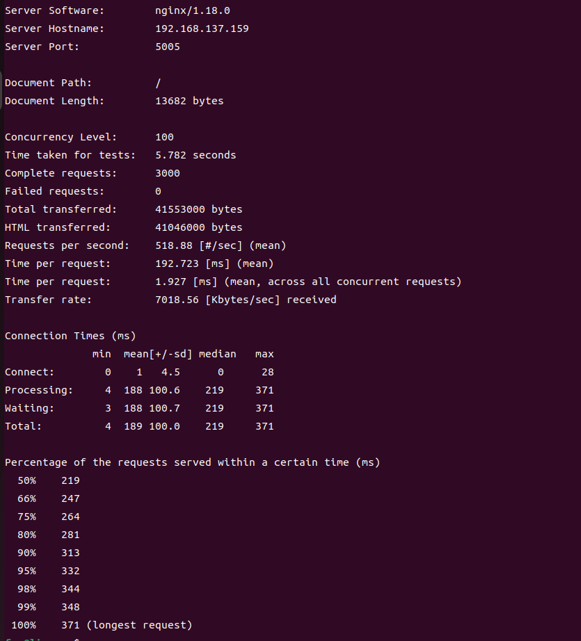
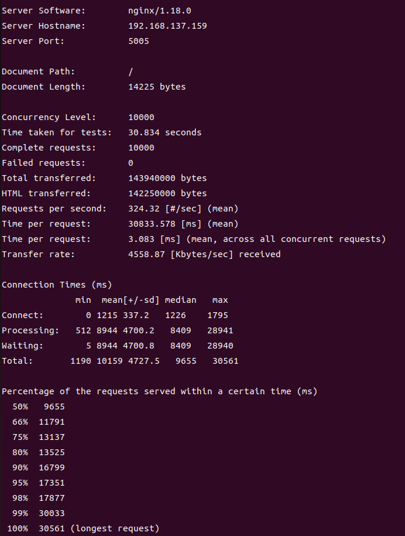
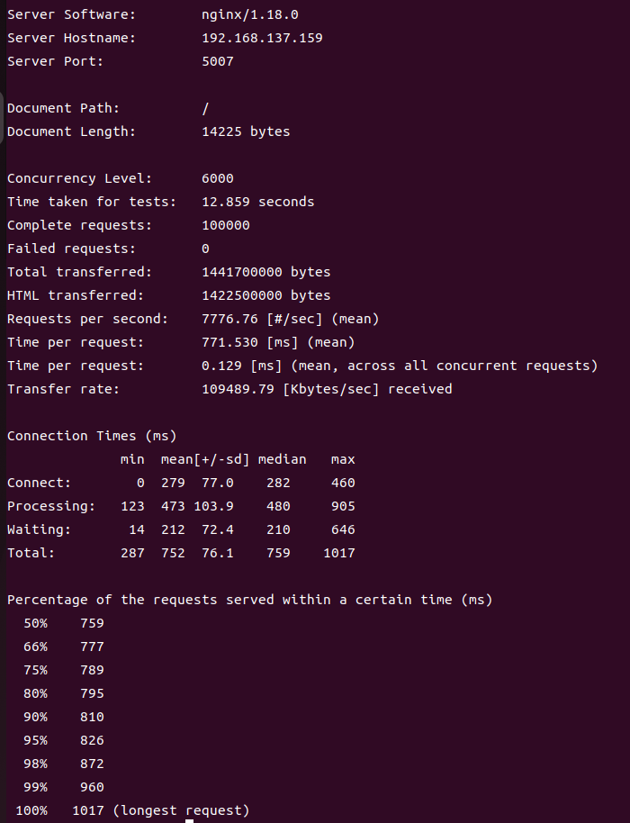

## 配置过程
#### 配置文件如下：
```nginx
user root;
worker_processes auto;
pid /run/nginx.pid;
include /etc/nginx/modules-enabled/*.conf;

events {
	worker_connections 768;
	# multi_accept on;
}

http {

	##
	# Basic Settings
	##

	sendfile on;
	tcp_nopush on;
	tcp_nodelay on;
	keepalive_timeout 65;
	types_hash_max_size 2048;
	# server_tokens off;

	# server_names_hash_bucket_size 64;
	# server_name_in_redirect off;

	include /etc/nginx/mime.types;
	default_type application/octet-stream;

	##
	# SSL Settings
	##

	ssl_protocols TLSv1 TLSv1.1 TLSv1.2; # Dropping SSLv3, ref: POODLE
	ssl_prefer_server_ciphers on;

	##
	# Logging Settings
	##

	access_log /var/log/nginx/access.log;
	error_log /var/log/nginx/error.log;

	##
	# Gzip Settings
	##

	gzip on;

	# gzip_vary on;
	# gzip_proxied any;
	# gzip_comp_level 6;
	# gzip_buffers 16 8k;
	# gzip_http_version 1.1;
	# gzip_types text/plain text/css application/json application/javascript text/xml application/xml application/xml+rss text/javascript;

	##
	# Virtual Host Configs
	##

	include /etc/nginx/conf.d/*.conf;
	include /etc/nginx/sites-enabled/*;
upstream domain{
        server localhost:5001;
        server localhost:5002;
        server localhost:5003;
        server localhost:5000;
}
server {  
        listen       5005;        
        server_name  localhost;

        location / {
            #root   html; # Nginx默认值
            #index  index.html index.htm;
            proxy_pass http://domain;
            proxy_set_header Host $host:$server_port;
        }
}
}
```
在配置文件中的http中设置一个upstream，其中有四个服务器运行的IP地址以及端口,然后在server模块中设置监听5005模块，当访问到根url"/"时，location会返回http://domain (也就是前面设置的upstream的名字)，这样nginx就会根据设置的负载均衡策略(此处缺省则策略为循环，也就是依次访问upstream中设置的服务器)将发送到localhost:5005的请求转发到upstream中设置的其中一个服务器中。这样即实现了反向代理以及负载均衡。
#### 测试结果
使用`ab -m GET -n 3000 -c 100 http://localhost:5005/`命令使用apache bench向nginx服务器发送3000个请求，并发数为100，可以看到测试结果如下：  
  
测试过发现最多只能承受300的并发数，故还需优化性能。

## 性能优化
#### 提高并发数
在虚拟机设置中将cpu个数改为4，cpu核心数改为2，获得八个cpu核心，然后在nginx设置中将`worker_processes` 改为8，等于cpu核心数，将`worker_cpu_affinity`的值设置为00000001 00000010 00000100 00001000 00010000 00100000 01000000 10000000，即将每个nginx进程分配在不同的cpu上。
并将`worker_rlimit_nofile`设置成204800，让nginx可以同时打开204800个文件(该值一般与ulimit中设置的最大可打开文件数相同)同时在events块中将`worker_connections`改为204800，让nginx可以打开更多的连接。
然后在终端中输入`ulimit -n 204800`命令将系统允许打开的最大文件数设置成204800以便可以打开更多的socket用于通信。
```nginx
worker_processes 8;
worker_cpu_affinity 00000001 00000010 00000100 00001000 00010000 00100000 01000000 10000000;
worker_rlimit_nofile 204800;

events {
	worker_connections 204800;
}
```
设置完毕后再使用`ab`命令测试最大可以承受的并发数，可以发现可以达到10000的并发，如图所示  
  
但是从图中可以看到Requests per second只有324，故还需要提高性能。
#### 提高requests per second
1. 设置客户端请求体缓存区大小: 
    ```nginx
    client_body_buffer_size 8K;   # 设置客户端请求体缓冲区大小
    client_header_buffer_size 8k; # 设置客户端请求头部缓冲区大小
    client_max_body_size 8k;      # 设置允许的最大客户端请求体大小
    large_client_header_buffers 4 16k;#客户端请求头部缓冲区大小
    ```
2. 打开multi_accept使其可以接受多个请求，并设置处理事件模型为linux下的epoll模型
    ```nginx
    events {
	    multi_accept on;
	    use epoll;
    }
    ```
3. 开启高校文件传输模式，并打开tcp_nopush防止网路堵塞
    ```nginx
    sendfile on;
	tcp_nopush on;
    ```

4. 关闭access.log的写入，并设置只写入重要的error到error.log中
    ```nginx
    access_log off;
	error_log /var/log/nginx/error.log crit;
    ```

5. 打开压缩功能，设置最小的压缩文件大小为1k(再小就没必要压缩了，那样可能压缩完文件更大了)，压缩比例设置为6(小的话压缩效果不好，大的话消耗太多cpu性能)，并设置版本以及需要压缩的文件类型
    ```nginx
    gzip_vary on;
	gzip_min_length 1k;
	gzip_comp_level 4;
	gzip_buffers 8 32k;
	gzip_http_version 1.1;
	gzip_types text/plain text/css application/json application/javascript text/xml application/xml application/xml+rss text/javascript;
    ```
6. 设置缓存
    ```nginx
    proxy_cache_path /home/fan/upfile levels=1:2 keys_zone=my_cache:10m max_size=10g; # 设置压缩文件路径以及缓存区最大大小等
    location / {
	    proxy_cache my_cache; 
	    proxy_cache_valid 200 302 10m; #返回码为200 302的缓存10分钟
	    proxy_cache_valid 404 1m; #返回码为404的缓存1分钟
        }
    ```
7. 接下来修改一些Linux的系统设置
    ```shell
    net.core.somaxconn = 262144 #修改系统可同时打开的tcp连接数
    net.ipv4.tcp_tw_reuse = 1 #设置tcp连接重用
    net.ipv4.tcp_syncookies = 0 #不抵御洪水攻击
    net.ipv4.tcp_max_orphans = 262144 #该参数用于设定系统中最多允许存在多少TCP套接字不被关联到任何一个用户文件句柄上，主要目的为防止Ddos攻击
    net.core.netdev_max_backlog = 262144 #每个网络接口接收数据包的速率比内核处理这些包的速率快时，允许送到队列的数据包的最大数目。
    net.ipv4.tcp_max_orphans = 262144 #系统中最多有多少个TCP套接字不被关联到任何一个用户文件句柄上。如果超过这个数字，孤儿连接将即刻被复位并打印出警告信息。这个限制仅仅是为了防止简单的DoS攻击
    net.ipv4.tcp_max_syn_backlog = 262144 #记录的那些尚未收到客户端确认信息的连接请求的最大值
    net.ipv4.tcp_max_tw_buckets = 6000 #timewait的数量
    ```
    将这些内容写入/etc/sysctl.conf文件中，并使用`sysctl -p`命令使这些设置生效。

最后再使用`ab -m GET -c 6000 -n 100000 http://localhost:5005/`命令测试性能，可以看到requests per second提升到了7700次每秒，如图(这里将nginx监听的端口改为了5007)：  
  

## 完整配置文件
最后贴一下完整的nginx配置文件

```nginx
user root;
worker_processes 8;
worker_cpu_affinity 00000001 00000010 00000100 00001000 00010000 00100000 01000000 10000000;
worker_rlimit_nofile 204800;
pid /run/nginx.pid;
include /etc/nginx/modules-enabled/*.conf;

events {
	worker_connections 204800;
	multi_accept on;
	use epoll;
}

http {

	##
	# Basic Settings
	##
	client_body_buffer_size 8K;   # 设置客户端请求体缓冲区大小
        client_header_buffer_size 8k; # 设置客户端请求头部缓冲区大小
        client_max_body_size 8k;      # 设置允许的最大客户端请求体大小
        large_client_header_buffers 4 16k;#客户端请求头部缓冲区大小

	sendfile on;
	tcp_nopush on;
	types_hash_max_size 2048;


	include /etc/nginx/mime.types;
	default_type application/octet-stream;


	access_log off;
	error_log /var/log/nginx/error.log crit;

	##
	# Gzip Settings
	##

	gzip on;

	gzip_vary on;
	gzip_min_length 1k;
	gzip_comp_level 4;
	gzip_buffers 8 32k;
	gzip_http_version 1.1;
	gzip_types text/plain text/css application/json application/javascript text/xml application/xml application/xml+rss text/javascript;
	
	proxy_connect_timeout 90;
        proxy_send_timeout  90;
        proxy_read_timeout  90;
        proxy_buffers 4 32k;
        proxy_busy_buffers_size 64k;
        
        proxy_cache_path /home/fan/upfile levels=1:2 keys_zone=my_cache:10m max_size=10g;

	##
	# Virtual Host Configs
	##

	include /etc/nginx/conf.d/*.conf;
	include /etc/nginx/sites-enabled/*;

upstream domain{
        server localhost:5001;
        server localhost:5002;
        server localhost:5003;
        server localhost:5000;

server {  
        listen       5005;    
        server_name  localhost;

        location / {
	    proxy_cache my_cache;
	    proxy_cache_valid 200 302 10m;
	    proxy_cache_valid 404 1m;
	    
            proxy_pass http://domain;
            proxy_set_header Host $host:$server_port;
        }
        location ~* \.(jpg|jepg|png|gif|ico|css|html|js)$ {
            expires 30d;
            add_header Cache-Control "public";
        }


}

    server { #这里是配置的监控模块
        listen 127.0.0.1:8080; # 监听的地址和端口
        server_name localhost; # 服务器名，可以是任意名字

        location /nginx_status {
            stub_status on; # 启用状态模块
            access_log off; # 关闭访问日志
            allow 127.0.0.1; # 允许访问的IP
            deny all; # 禁止其他IP访问
        }
    }

}
}
```
