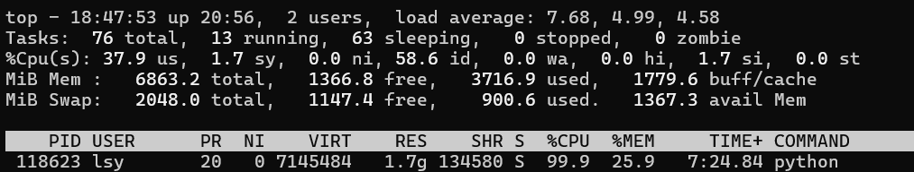
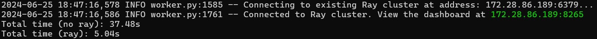

# Ray 性能测试和分析

### 测试代码

```python
import numpy as np
import time
import ray

ray.init()

n = 1000    # 矩阵大小
T = 100     # 测试数
matrices = [np.random.rand(n, n) for _ in range(T)]

def work(A):
    return np.linalg.inv(A)
@ray.remote
def work_ray(A):
    return np.linalg.inv(A)

# 无ray测试
start_time = time.time()
results = [work(A) for A in matrices]
print(f"Total time (no ray): {time.time() - start_time:.2f}s")

# ray测试
start_time = time.time()
results_ray = ray.get([work_ray.remote(A) for A in matrices])
print(f"Total time (ray): {time.time() - start_time:.2f}s")

# 正确性检查
for i in range(T):
    if not np.allclose(results[i], results_ray[i]):
        print("Wrong result!", i)
```

### 性能指标

1. 总执行时间：从计算开始到结束的总执行时间
2. 吞吐量：单位时间内完成的任务量
3. CPU占用率：计算时在各结点上的CPU占用率
4. 延迟：一个任务从请求到完成的时间
5. 额外开销：除计算外消耗的时间，如 Ray 的调度用时

本实验中，我们选择吞吐量和CPU占用率作为指标进行测试。这两个指标易于测量，且能很好地反应计算系统的性能。

### 单机测试与优化

*CPU为12核*

不用Ray时，使用top查看CPU使用率





|         | 吞吐量  | CPU占用率 |
| ------- | ------- | --------- |
| 不用Ray | 2.67/s  | 99.9%     |
| 用Ray   | 19.84/s | 84.7%     |

可以看到，用Ray后吞吐量为原来**7.4倍**，且平均CPU占用率更低。

这个结果令人惊讶，接下来进一步实验来分析原因。

```python
@ray.remote(num_cpus=12)
def work_ray(A):
    return np.linalg.inv(A)
```

|                     | 吞吐量 | CPU占用率 |
| ------------------- | ------ | --------- |
| 用Ray (num_cpus=12) | 2.26/s | 90.9%     |

分析：上面实验中Ray的优化主要来自于把独立的任务并行处理。虽然numpy本身支持多核，但同一个任务中使用多核处理的额外开销很大。使用Ray后，Ray给每个任务分配给一个核执行，多个核可以在任务层面并行地处理，效率很高。

### 分布式性能测试

*CPU为12核+12核*

使用docker部署，测试 n=1000, T=1000

```
(base) ray@bb113b5d00c2:~$ python ray_task2.py
2024-06-24 22:49:41,522 INFO worker.py:1568 -- Connecting to existing Ray cluster at address: 172.18.0.2:6379...
2024-06-24 22:49:41,534 INFO worker.py:1744 -- Connected to Ray cluster. View the dashboard at 172.18.0.2:8265
Starting...
Total time: 34.07s
```

|            | 吞吐量  | CPU占用率 |
| ---------- | ------- | --------- |
| Ray 分布式 | 29.35/s | 84.6%     |

计算资源增加后，吞吐量进一步提升。
