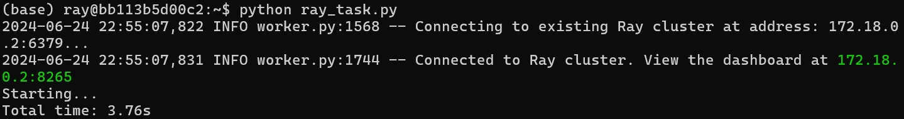
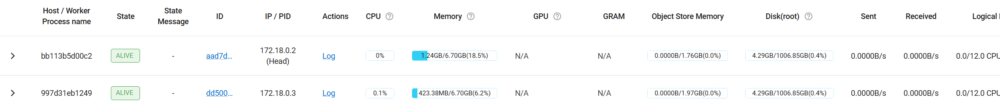

# Ray 部署说明

## 单机部署

环境：

- Ubuntu 22.04.3 (WSL 2.2.4.0)
- Python 3.10.12

**安装Ray**

```sh
# 注：不加default安装后没有dashboard
pip install -U "ray[default]"
```

```
$ ray --version
ray, version 2.20.0
```

**启动Ray**

```sh
ray start --head --dashboard-host='0.0.0.0' --dashboard-port=8265
```

显示

```
To add another node to this Ray cluster, run
    ray start --address='xxx.xxx.xxx.xxx:6379'
To monitor and debug Ray, view the dashboard at
    xxx.xxx.xxx.xxx:8265
```

进入该网址即可查看 dashboard。

## Docker 部署

**下载镜像**

```sh
docker pull rayproject/ray
```

*注：2024/6/6 后所有 dockerhub 镜像站都被封停，导致下载很慢。*

**启动容器**

```sh
docker run --shm-size=4G -tip 8265:8265 -p 6379:6379 rayproject/ray
```

**在容器中启动ray**

```sh
ray start --head --dashboard-host='0.0.0.0' --dashboard-port=8265
```

**将测试文件放入容器**

```shell
# 填入容器的id或名字 
docker cp .\ray_task.py (container_id):/home/ray/
```

**运行测试代码**



## 分布式部署

需要连接到同一局域网。主结点启动后，从结点输入

```
ray start --address='xxx.xxx.xxx.xxx:6379'
```

启动成功后，查看主结点的dashboard下的cluster栏，可以看到



连上后，运行python程序即可将计算任务分发给每个结点。

