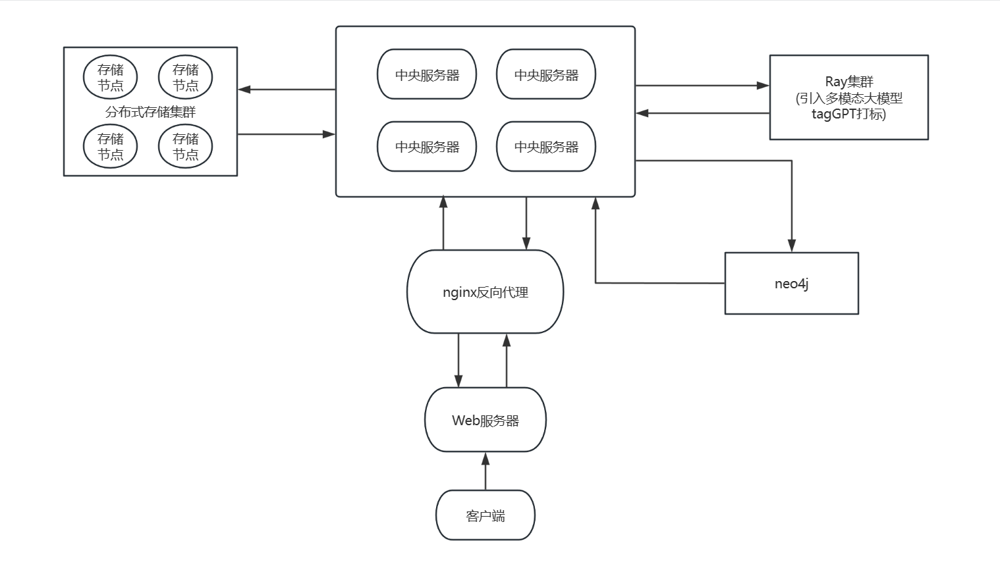
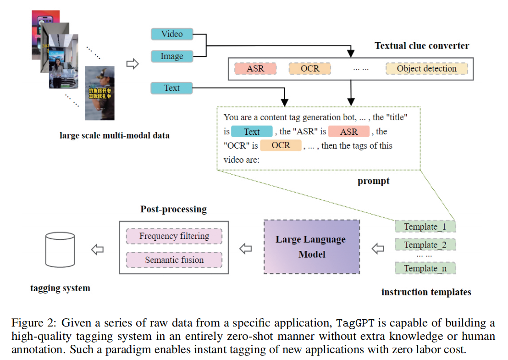

## 目录
- [调研报告](#调研报告)
  - [小组成员](#小组成员)
  - [项目背景](#项目背景)
    - [分布式文件系统](#分布式文件系统)
    - [图文件系统DisGraFS](#图文件系统disgrafs)
      - [操作实现](#操作实现)
    - [图数据库](#图数据库)
      - [定义](#定义)
      - [特点](#特点)
      - [图数据库的关键概念](#图数据库的关键概念)
      - [Neo4j](#neo4j)
        - [优点：](#优点)
        - [缺点：](#缺点)
    - [分布式计算框架](#分布式计算框架)
      - [Ray简介](#ray简介)
      - [Ray 有如下特点](#ray-有如下特点)
      - [Ray 架构](#ray-架构)
      - [用途](#用途)
        - [Ray的优点](#ray的优点)
    - [过往项目缺点](#过往项目缺点)
  - [立项依据](#立项依据)
    - [大模型](#大模型)
      - [大模型的定义](#大模型的定义)
      - [大模型相关概念区分：](#大模型相关概念区分)
      - [大模型的特点](#大模型的特点)
      - [大模型的分类](#大模型的分类)
    - [多模态大模型统一索引](#多模态大模型统一索引)
    - [TagGPT](#taggpt)
      - [要点:](#要点)
      - [工作流程图](#工作流程图)
      - [Github连接](#github连接)
      - [总结:](#总结)
    - [主服务器优化](#主服务器优化)
      - [nginx](#nginx)
      - [代理](#代理)
      - [正向代理](#正向代理)
      - [反向代理](#反向代理)
      - [反向代理优势](#反向代理优势)
  - [前瞻性/重要性分析](#前瞻性重要性分析)
  - [相关工作](#相关工作)
    - [科学界相关工作](#科学界相关工作)
    - [往年小组相关工作](#往年小组相关工作)
    - [相关实际用途与工业界相关工作](#相关实际用途与工业界相关工作)
  - [参考资料](#参考资料)
# 调研报告

## 小组成员
* 马耀华（组长）
* 马筱雅
* 范明瑞
* 吕思源
* 刘畅

## 项目背景
随着信息的快速增长，人们需要处理和记忆的信息也越来越多。这就对我们如何存储和管理信息提出了很高的要求。目前的文件系统大部分是采用树形结构的，这种结构需要人们在查找文件时了解文件的大概名称和位置，所以不太符合人类的思维习惯。
为了克服这个困难，图文件系统---一种图结构的文件系统，它可以用图来展示文件之间的关系，关注了文件之间的相似性，文件的寻找不单依赖于名称和路径，使得文件创建者和非文件创建者均能较容易查找到文件，更符合当前社会发展趋势。

其次，在信息化时代，人们每天都有很大的信息化需求，为了提供更高效的服务，图文件系统也应包含分布式框架，利用多节点来均衡负载。

此外，现代社会数据的形式不断丰富，文件格式不尽相同，图片，视频，文字等形式均有很大的存储需求，所以图文件系统也应支持多种文件形式，从而实现多模态，更好地满足人们日益丰富的存储需求。

本项目基于[2023-My-Glow](https://github.com/OSH-2023/My-Glow)小组进行优化

### 分布式文件系统
> &emsp;&emsp;分布式文件系统是一种用于存储和管理数据的系统，它通过将数据分布在多个计算机节点上，并提供统一的访问接口，从而实现数据的共享和可靠性存储。分布式文件系统的背景可以追溯到对传统集中式文件系统在大规模数据存储和高并发访问下的局限性的需求。
  &emsp;&emsp;传统的集中式文件系统存在着单点故障、存储容量受限、扩展性差等问题。随着互联网和大数据时代的到来，人们对存储系统的要求变得越来越苛刻，需要能够存储海量数据、支持高并发访问、具备高可靠性和高性能的存储解决方案。因此，分布式文件系统应运而生，它可以通过在多台服务器上分布数据来解决传统集中式文件系统的瓶颈问题。
  &emsp;&emsp;在云计算、大数据分析、互联网服务等领域，分布式文件系统已经成为了存储基础设施的主流选择，如Hadoop分布式文件系统（HDFS）、谷歌文件系统（GFS）、亚马逊S3等。这些系统的出现极大地促进了大规模数据的存储、管理和分析，推动了信息技术的发展和创新。
  **分布式文件系统的设计旨在实现以下目标**：
- 可靠性：通过数据冗余和容错机制，保证数据的安全性和可靠性。
- 扩展性：能够方便地扩展存储容量和计算资源，以适应不断增长的数据量和用户需求。
- 高性能：支持高并发读写操作，并提供快速的数据访问速度。
- 统一命名空间：为用户提供统一的文件访问接口，隐藏分布式存储的细节。
  弹性和灵活性：适应各种网络环境和硬件设备，并能够应对节点故障和网络分区等异常情况
### 图文件系统DisGraFS
 DisGraFS分为5个组成部分：索引服务器、分布式存储集群、分布式计算集群、网页端和客户端。
 - **索引服务器**：进行分布式存储集群与分布式计算集群的通信、网页端部署的位置，目前也负责构建与维护图数据库（但若有需要，也可将图数据库的部分分离出去）；
 - **分布式存储集群**：基于 Juicefs 的分布式储存系统，管理、存储和调度分布式存储系统中的所有文件；
 - **分布式计算集群**：基于 Ray 的分布式计算系统，将文本语义识别、图像识别、语音识别以及元数据提取等任务分散给计算集群中的多个计算机；
 - **网页端**：直观显示文件所构成的图，并将用户在图上的操作以友好方式展示。
 - **客户端**：客户端负责直接接收用户对文件系统的操作，并针对不同的平台对其进行实现。
 
#### 操作实现

一个完整的文件系统需支持新增文件、文件搜索、获取文件和删除文件的操作。
下面分别介绍这些操作在DisGraFS上的实现流程。
- **新增文件**
1. 用户在网页端启动客户端，将分布式存储集群挂载在本地电脑上；
2. 用户将需要上传的文件直接拖入 JuiceFS 对应的盘，此时分布式存储系统对文件进行切分并通过合理调度将文件分布式地存储在存储集群中；
3. 分布式存储集群发信息给索引服务器，索引服务器将信息转发给分布式计算集群，开始对文件进行内容识别并且打出标签；
4. 打标完成后，分布式计算集群将标签以及文件其他信息一起发送返回给索引服务器，索引服务器根据收到的标签以及文件信息更新图数据库。
- **文件搜索**
5. 用户在网页端提出文件搜索请求，网页端将搜索关键字（可以是标签，也可以是文件名）上传至索引服务器；
6. 索引服务器根据关键字创建搜索语句，在图数据库中搜索，将具有相关标签的所有文件通过图和列表两种方式返回至网页端；
7. 用户可以根据网页端返回的图，直接通过点击获得某一文件的标签与信息，或者获得具有某一标签的所有文件，实现根据文件内容进行搜索以及在图上直接搜索邻顶的目标。
- **文件获取**
8. 用户在关键词搜索返回的文件中找到自己需要的文件，点击打开文件的按键，服务器将消息传给 JuiceFS 分布式存储集群；
9. 分布式存储集群找到需要打开的文件，将其下载到用户本地存储空间并将其打开。
- **删除文件**
10. 用户在客户端提出删除文件的请求，客户端将目标文件名上传至索引服务器；
11. 索引服务器将信息传递给分布式存储集群，分布式存储集群将文件删除；
12. 索引服务器根据文件名删除图数据库中对应的节点，更新图数据库。

### 图数据库
#### 定义
   图数据库（graph database，GDB）是一种使用图结构进行语义查询的数据库。
   #### 特点
   - 图数据库中使用节点、边、属性来表示和存储数据。该系统的一个关键概念是图，其将存储中的数据项与数据节点以及节点间表示关系的边的集合进行关联，从而使用节点之间以边相连的图结构进行数据的表示。这些关系使得数据库中的数据直接链接在一起，易于检索。使用图数据库进行数据之间关系的表示非常直观，对于存储高度相连的数据非常有效。
   - 图数据库属于NoSQL的一种，因此其没有特定的SQL查询语言，而是每种数据库使用一种单独的语言，如cypher、GSQL等。但这种情况在不久的将来可能会有所改变：2019 年一种名为[GQL](https://en.wikipedia.org/wiki/Graph_Query_Language)（图形查询语言）的标准语言被提出，并获得了 ISO/IEC 委员会的批准。GQL 旨在成为一种类似于 SQL 的声明性语言，但借用了当前图形查询实现（如 Cypher 和 GSQL）的功能。
   #### 图数据库的关键概念
   1. 节点：
     节点用来表示实体或者实例，大致相当于关系数据库中的记录。
   2. 边：
      边位于两个节点之间，用来表示关系。边可以有向可以无向，例如在人际关系图中，有向边可用来表示两个人之间单向相识；在兴趣图中，无向边可以用来表示一个人对某种事件感兴趣。
   3. 属性：
      属性是节点相关的信息。节点的属性反映了节点的性质与内容，可通过节点的属性进行关系的搭建与搜索。例如在人际关系图中，两个人同时认识一个人，则二人均具有“与某人相识“的属性，并可通过该属性在二人之间进行查找。
   4. 路径：
      路径由至少一个节点，通过各种关系连接组成，常作为一个查询或者遍历的结果。
   5. 遍历：
      对图的遍历指根据节点之间的关系，访问到所有的节点。
   #### Neo4j

Neo4j是一个高性能的NOSQL图形数据库，它将结构化数据存储在图上而不是表中。它是一个嵌入式的、基于磁盘的、具备完全的事务特性的Java持久化高性能引擎，该引擎具有成熟数据库的所有特性。它是一个可扩展、符合 ACID 的图形数据库，采用了高性能分布式集群架构设计，并可用于自托管和云产品。查询语言为cypher，编写语言为java；
##### 优点：
* 支持多种操作系统；
* 生态较为完整，使用量大，有较多资料和工具；
* 提供多种API接口；
* 层数较低时查找效率可观；
##### 缺点：

* 非分布式；
* 在层数较多时查找效率低。
### 分布式计算框架
   #### Ray简介
   Ray 是伯克利大学 RISELab 研发的一个简单高效的分布式计算引擎，为开发者提供了简单通用的API来构建分布式程序。
   Ray 能够让开发者轻松地构建分布式程序，靠的是通过简单的API来将计算任务分解为以下的计算原语来执行：（以下两段来自实验文档）
   - Task：一个无状态的计算任务（函数表示）。Ray 允许异步执行任意函数。这些"remote function"（Task）的开销非常低，可以在毫秒内执行，并且可以自动向集群添加节点并调度任务，非常适合扩展计算密集型应用程序和服务。
   - Actor：一个有状态的计算任务（类表示）。Actor 模型是一个强大的异步编程范例（支持微服务），可以在本地和远程无缝工作。Actor 本质上是一个有状态的 Worker（或 service）。当一个新的 Actor 被实例化时，就创建一个新的 Worker，并将该 Actor 的方法调度到这个特定的 Worker，也可以对 Worker 的状态进行访问和修改。
   #### Ray 有如下特点
   - 分布式异步调用
   - 内存调度
   - Pandas/Numpy 的分布式支持
   - 支持 Python
   - 整体性能出众
   #### Ray 架构
   Ray架构分为应用层和系统层组成，应用层提供了Ray API，系统层保障Ray的高可扩展和容错性；
   
   应用层对应了三种类型的进程：**驱动进程、工作器进程、行动器进程组成；**
     **驱动器 (Driver ):** 执行用户程序的进程，所有操作都需要由主进程来驱动。
     **工作器 (Worker ):** 执行由驱动器或其他工作器调用的任务（远程函数）的无状态的进程。工作器是在系统层分配任务时自动启动的。当声明一个远程函数时，该函数将被自动发送到所有的工作器中。在同一个工作器中，任务是串行地执行的，工作器并不维护其任务与任务之间的局部状态，即在工作器中，一个远程函数执行完后，其局部作用域的所有变量将不再能被其他任务所访问。
     **行动器 (Actor ):** 行动器被调用时只执行其所暴露的方法。行动器由工作器或驱动器显式地进行实例化。与工作器相同的是，行动器也会串行地执行任务，不同的是行动器上执行的每个方法都依赖于其前面所执行的方法所变更的状态。
   #### 用途
   - 用于常见机器学习任务的可扩展库，如**数据预处理、分布式训练、超参数调优、强化学习和模型服务data preprocessing, distributed training, hyperparameter tuning, reinforcement learning, and model serving**。
   - 用于[并行化](https://www.zhihu.com/search?q=并行化&search_source=Entity&hybrid_search_source=Entity&hybrid_search_extra={"sourceType"%3A"article"%2C"sourceId"%3A"685305240"})和扩展Python应用程序的Python[分布式计算](https://www.zhihu.com/search?q=分布式计算&search_source=Entity&hybrid_search_source=Entity&hybrid_search_extra={"sourceType"%3A"article"%2C"sourceId"%3A"685305240"})原语。
   - 用于与现有工具和基础设施(如***[Kubernetes](https://www.zhihu.com/search?q=Kubernetes&search_source=Entity&hybrid_search_source=Entity&hybrid_search_extra={"sourceType"%3A"article"%2C"sourceId"%3A"685305240"})\***、AWS、GCP和Azure)集成和部署Ray集群的集成和实用程序
   ##### Ray的优点
   - 细粒度负载均衡：利用任务级粒度的负载感知调度来进行细粒度的负载均衡
   - 输入数据本地化：每个任务可以在存有它所需要的数据的节点上调度
   - 较低的恢复开销：无需记录检查点或恢复到中间状态
### 过往项目缺点
   2021年[x-DisGraFS](https://github.com/OSH-2021/x-DisGraFS)小组首先搭建图文件系统，接着很多小组进行了优化，但仍有些缺点
   - 打标模型太过复杂，对数据没有统一的处理方式
   - 负载均衡效果不够理想，伸缩性和可扩展性欠佳
   - 安全性和隐私性的保护不够完善
   - 稳定性
***

## 立项依据

基于现有技术和往届小组的工作，我们打算在 2023 年 [My-Glow](https://github.com/OSH-2023/My-Glow) 小组项目的基础上在以下两个方面进行相应优化：

1. 用现成的大模型 taggpt（一个完全自动化的系统，能够以完全零-shot的方式进行标签提取和多模态标记）对文件进行打标并建立索引，取代之前用不同的模型对不同类型文件进行打标的做法。

2. 可以使用 nginx 反向代理技术将分布式文件系统的主服务器内容部署到分布式集群中，提高性能、可用性和安全性。

**优化前：**

**优化后：**

**以下是立项依据:**

### 大模型

#### 大模型的定义

> 大模型是指具有大规模参数和复杂计算结构的机器学习模型。这些模型通常由[深度神经网络](https://xie.infoq.cn/link?target=https%3A%2F%2Fwww.zhihu.com%2Fsearch%3Fq%3D%E6%B7%B1%E5%BA%A6%E7%A5%9E%E7%BB%8F%E7%BD%91%E7%BB%9C%26search_source%3DEntity%26hybrid_search_source%3DEntity%26hybrid_search_extra%3D%7B%22sourceType%22%3A%22answer%22%2C%22sourceId%22%3A3271533824%7D)构建而成，拥有数十亿甚至数千亿个参数。大模型的设计目的是为了提高模型的表达能力和预测性能，能够处理更加复杂的任务和数据。大模型在各种领域都有广泛的应用，包括[自然语言处理](https://xie.infoq.cn/link?target=https%3A%2F%2Fwww.zhihu.com%2Fsearch%3Fq%3D%E8%87%AA%E7%84%B6%E8%AF%AD%E8%A8%80%E5%A4%84%E7%90%86%26search_source%3DEntity%26hybrid_search_source%3DEntity%26hybrid_search_extra%3D%7B%22sourceType%22%3A%22answer%22%2C%22sourceId%22%3A3271533824%7D)、计算机视觉、语音识别和[推荐系统](https://xie.infoq.cn/link?target=https%3A%2F%2Fwww.zhihu.com%2Fsearch%3Fq%3D%E6%8E%A8%E8%8D%90%E7%B3%BB%E7%BB%9F%26search_source%3DEntity%26hybrid_search_source%3DEntity%26hybrid_search_extra%3D%7B%22sourceType%22%3A%22answer%22%2C%22sourceId%22%3A3271533824%7D)等。大模型通过训练海量数据来学习复杂的模式和特征，具有更强大的[泛化能力](https://xie.infoq.cn/link?target=https%3A%2F%2Fwww.zhihu.com%2Fsearch%3Fq%3D%E6%B3%9B%E5%8C%96%E8%83%BD%E5%8A%9B%26search_source%3DEntity%26hybrid_search_source%3DEntity%26hybrid_search_extra%3D%7B%22sourceType%22%3A%22answer%22%2C%22sourceId%22%3A3271533824%7D)，可以对未见过的数据做出准确的预测。

> ChatGPT 对大模型的解释更为通俗易懂，也更体现出类似人类的归纳和思考能力：大模型本质上是一个使用海量数据训练而成的深度[神经网络模型](https://xie.infoq.cn/link?target=https%3A%2F%2Fwww.zhihu.com%2Fsearch%3Fq%3D%E7%A5%9E%E7%BB%8F%E7%BD%91%E7%BB%9C%E6%A8%A1%E5%9E%8B%26search_source%3DEntity%26hybrid_search_source%3DEntity%26hybrid_search_extra%3D%7B%22sourceType%22%3A%22answer%22%2C%22sourceId%22%3A3271533824%7D)，其巨大的数据和参数规模，实现了智能的涌现，展现出类似人类的智能。

#### 大模型相关概念区分：

**大模型（Large Model,也称基础模型，即 Foundation Model)是**指具有大量参数和复杂结构的机器学习模型，能够处理海量数据、完成各种复杂的任务，如自然语言处理、计算机视觉、语音识别等。

**超大模型**：超大模型是大模型的一个子集，它们的参数量远超过大模型。

**[大语言模型](https://xie.infoq.cn/link?target=https%3A%2F%2Fwww.zhihu.com%2Fsearch%3Fq%3D%E5%A4%A7%E8%AF%AD%E8%A8%80%E6%A8%A1%E5%9E%8B%26search_source%3DEntity%26hybrid_search_source%3DEntity%26hybrid_search_extra%3D%7B%22sourceType%22%3A%22answer%22%2C%22sourceId%22%3A3271533824%7D) Large Language Model**通常是具有大规模参数和计算能力的自然语言处理模型，例如 OpenAI 的 GPT-3 模型。这些模型可以通过大量的数据和参数进行训练，以生成人类类似的文本或回答自然语言的问题。[大型语言模型](https://xie.infoq.cn/link?target=https%3A%2F%2Fwww.zhihu.com%2Fsearch%3Fq%3D%E5%A4%A7%E5%9E%8B%E8%AF%AD%E8%A8%80%E6%A8%A1%E5%9E%8B%26search_source%3DEntity%26hybrid_search_source%3DEntity%26hybrid_search_extra%3D%7B%22sourceType%22%3A%22answer%22%2C%22sourceId%22%3A3271533824%7D)在自然语言处理、文本生成和智能对话等领域有广泛应用。

**GPT 即Generative Pre-trained Transformer**，GPT 和 ChatGPT 都是基于 Transformer 架构的语言模型，但它们在设计和应用上存在区别：GPT 模型旨在生成自然语言文本并处理各种自然语言处理任务，如文本生成、翻译、摘要等。它通常在单向生成的情况下使用，即根据给定的文本生成连贯的输出。

**ChatGPT**：ChatGPT 则专注于对话和交互式对话。它经过特定的训练，以更好地处理[多轮对话](https://xie.infoq.cn/link?target=https%3A%2F%2Fwww.zhihu.com%2Fsearch%3Fq%3D%E5%A4%9A%E8%BD%AE%E5%AF%B9%E8%AF%9D%26search_source%3DEntity%26hybrid_search_source%3DEntity%26hybrid_search_extra%3D%7B%22sourceType%22%3A%22answer%22%2C%22sourceId%22%3A3271533824%7D)和上下文理解。ChatGPT 设计用于提供流畅、连贯和有趣的对话体验，以响应用户的输入并生成合适的回复。

**多模态大模型**：是指能够处理多种不同类型数据的大模型，例如文本、图像、音频等多模态数据。这类模型结合了 NLP 和 CV 的能力，以实现对多模态信息的综合理解和分析，从而能够更全面地理解和处理复杂的数据。例如：DingoDB 多模向量数据库（九章云极 DataCanvas）、DALL-E(OpenAI)、悟空画画（华为）、midjourney。

#### 大模型的特点

- **巨大的规模:** 大模型包含数十亿个参数，模型大小可以达到数百 GB 甚至更大。巨大的模型规模使大模型具有强大的表达能力和学习能力。

- **涌现能力:** 涌现（英语：emergence）或称创发、突现、呈展、演生，是一种现象，为许多小实体相互作用后产生了大实体，而这个大实体展现了组成它的小实体所不具有的特性。引申到模型层面，涌现能力指的是当模型的训练数据突破一定规模，模型突然涌现出之前小模型所没有的、意料之外的、能够综合分析和解决更深层次问题的复杂能力和特性，展现出类似人类的思维和智能。**涌现能力也是大模型最显著的特点之一。**

- **更好的性能和泛化能力：** 大模型通常具有更强大的学习能力和泛化能力，能够在各种任务上表现出色，包括自然语言处理、图像识别、语音识别等。

- **多任务学习:** 大模型通常会一起学习多种不同的 NLP 任务,如机器翻译、文本摘要、问答系统等。这可以使模型学习到更广泛和泛化的语言理解能力。

- **大数据训练**: 大模型需要海量的数据来训练,通常在 TB 以上甚至 PB 级别的数据集。只有大量的数据才能发挥大模型的参数规模优势。

- **强大的计算资源**: 训练大模型通常需要数百甚至上千个 GPU,以及大量的时间,通常在几周到几个月。

- **迁移学习和预训练**： 大模型可以通过在大规模数据上进行预训练，然后在特定任务上进行微调，从而提高模型在新任务上的性能。

- **自监督学习**： 大模型可以通过自监督学习在大规模未标记数据上进行训练，从而减少对标记数据的依赖，提高模型的效能。

- **[领域知识融合](https://xie.infoq.cn/link?target=https%3A%2F%2Fwww.zhihu.com%2Fsearch%3Fq%3D%E9%A2%86%E5%9F%9F%E7%9F%A5%E8%AF%86%E8%9E%8D%E5%90%88%26search_source%3DEntity%26hybrid_search_source%3DEntity%26hybrid_search_extra%3D%7B%22sourceType%22%3A%22answer%22%2C%22sourceId%22%3A3271533824%7D)**： 大模型可以从多个领域的数据中学习知识，并在不同领域中进行应用，促进跨领域的创新。

- **自动化和效率**：大模型可以自动化许多复杂的任务，提高工作效率，如自动编程、自动翻译、自动摘要等。

#### 大模型的分类

按照输入数据类型的不同，大模型主要可以分为以下三大类：

- **[语言大模型](https://xie.infoq.cn/link?target=https%3A%2F%2Fwww.zhihu.com%2Fsearch%3Fq%3D%E8%AF%AD%E8%A8%80%E5%A4%A7%E6%A8%A1%E5%9E%8B%26search_source%3DEntity%26hybrid_search_source%3DEntity%26hybrid_search_extra%3D%7B%22sourceType%22%3A%22answer%22%2C%22sourceId%22%3A3271533824%7D)（NLP）**：是指在自然语言处理（Natural Language Processing，NLP）领域中的一类大模型，通常用于处理文本数据和理解自然语言。这类大模型的主要特点是它们在大规模语料库上进行了训练，以学习自然语言的各种语法、语义和语境规则。例如：GPT 系列（OpenAI）、Bard（Google）、[文心一言](https://xie.infoq.cn/link?target=https%3A%2F%2Fwww.zhihu.com%2Fsearch%3Fq%3D%E6%96%87%E5%BF%83%E4%B8%80%E8%A8%80%26search_source%3DEntity%26hybrid_search_source%3DEntity%26hybrid_search_extra%3D%7B%22sourceType%22%3A%22answer%22%2C%22sourceId%22%3A3271533824%7D)（百度）。

- **[视觉大模型](https://xie.infoq.cn/link?target=https%3A%2F%2Fwww.zhihu.com%2Fsearch%3Fq%3D%E8%A7%86%E8%A7%89%E5%A4%A7%E6%A8%A1%E5%9E%8B%26search_source%3DEntity%26hybrid_search_source%3DEntity%26hybrid_search_extra%3D%7B%22sourceType%22%3A%22answer%22%2C%22sourceId%22%3A3271533824%7D)（CV）**：是指在计算机视觉（Computer Vision，CV）领域中使用的大模型，通常用于图像处理和分析。这类模型通过在大规模图像数据上进行训练，可以实现各种视觉任务，如[图像分类](https://xie.infoq.cn/link?target=https%3A%2F%2Fwww.zhihu.com%2Fsearch%3Fq%3D%E5%9B%BE%E5%83%8F%E5%88%86%E7%B1%BB%26search_source%3DEntity%26hybrid_search_source%3DEntity%26hybrid_search_extra%3D%7B%22sourceType%22%3A%22answer%22%2C%22sourceId%22%3A3271533824%7D)、目标检测、[图像分割](https://xie.infoq.cn/link?target=https%3A%2F%2Fwww.zhihu.com%2Fsearch%3Fq%3D%E5%9B%BE%E5%83%8F%E5%88%86%E5%89%B2%26search_source%3DEntity%26hybrid_search_source%3DEntity%26hybrid_search_extra%3D%7B%22sourceType%22%3A%22answer%22%2C%22sourceId%22%3A3271533824%7D)、[姿态估计](https://xie.infoq.cn/link?target=https%3A%2F%2Fwww.zhihu.com%2Fsearch%3Fq%3D%E5%A7%BF%E6%80%81%E4%BC%B0%E8%AE%A1%26search_source%3DEntity%26hybrid_search_source%3DEntity%26hybrid_search_extra%3D%7B%22sourceType%22%3A%22answer%22%2C%22sourceId%22%3A3271533824%7D)、人脸识别等。例如：VIT 系列（Google）、[文心UFO](https://xie.infoq.cn/link?target=https%3A%2F%2Fwww.zhihu.com%2Fsearch%3Fq%3D%E6%96%87%E5%BF%83UFO%26search_source%3DEntity%26hybrid_search_source%3DEntity%26hybrid_search_extra%3D%7B%22sourceType%22%3A%22answer%22%2C%22sourceId%22%3A3271533824%7D)、华为盘古 CV、INTERN（商汤）。

- **多模态大模型：**是指能够处理多种不同类型数据的大模型，例如文本、图像、音频等多模态数据。这类模型结合了 NLP 和 CV 的能力，以实现对多模态信息的综合理解和分析，从而能够更全面地理解和处理复杂的数据。例如：DingoDB 多模向量数据库（九章云极 DataCanvas）、DALL-E(OpenAI)、悟空画画（华为）、midjourney。

按照应用领域的不同，大模型主要可以分为 L0、L1、L2 三个层级：

- **通用大模型 L0**：是指可以在多个领域和任务上通用的大模型。它们利用大算力、使用海量的开放数据与具有巨量参数的深度学习算法，在大规模无标注数据上进行训练，以寻找特征并发现规律，进而形成可“举一反三”的强大泛化能力，可在不进行微调或少量微调的情况下完成多场景任务，相当于 AI 完成了“通识教育”。

- **行业大模型 L1**：是指那些针对特定行业或领域的大模型。它们通常使用行业相关的数据进行预训练或微调，以提高在该领域的性能和准确度，相当于 AI 成为“行业专家”。

- **垂直大模型 L2**：是指那些针对特定任务或场景的大模型。它们通常使用任务相关的数据进行预训练或微调，以提高在该任务上的性能和效果。
### 多模态大模型统一索引
>&emsp;&emsp;统一索引模型指的是通过部署一个大型的神经网络模型来处理多模态数据的索引操作，避免为每种模态（例如图像、文本、音频等）单独部署不同的模型。这样做可以减少资源消耗和管理成本，并简化系统架构。大型模型可以学习并建立多模态数据之间的关联和相似性，从而实现高效的索引操作。

### TagGPT

#### 要点:

- 动机：标签在当代互联网应用中非常重要，如搜索引擎和推荐系统，而大型语言模型在多项任务中显示出令人印象深刻的能力，TagGPT旨在利用这些能力实现自动多模态标签提取和标记。
- 方法：通过精心设计的提示语，利用预训练大型语言模型提取和推理有关多模态数据的正确标签，TagGPT通过从原始数据中预测大规模候选标签，过滤语义和频率，自动构建高质量标签集合，为特定应用提供标签。对于需要标记分发的新实体，TagGPT提供两种零样本标记替代方案：一种是在标签集合中进行后期语义匹配的生成式方法，另一种是在提示中进行早期匹配的选择性方法。
- 优势：TagGPT是一种具有模块化框架的系统级解决方案，具有适用于现代社交媒体中各种数据形式的强大泛化能力。可以提供完整的标签系统构建和标记模型工具，并且可无缝地替换为任何更高级别的模型。实验结果表明，TagGPT的标记效果比现有的哈希标签和现成的标记器都要好。
#### 工作流程图

#### Github连接

[TencentARC-QQ/TagGPT: TagGPT: Large Language Models are Zero-shot Multimodal Taggers (github.com)](https://github.com/TencentARC-QQ/TagGPT)

#### 总结:

TagGPT 是基于预训练大型语言模型和句嵌入模型提出的一种全自动零样本系统 ，用于在多媒体数据中提取和标记标签。

### 主服务器优化
&emsp;&emsp;随着数据量的增长和用户访问量的提升，传统的单一服务器架构可能会面临性能瓶颈和可用性问题。为了提高系统的性能、可用性和安全性，需要将分布式文件系统的主服务器优化为分布式架构。通过这种方式，可以将系统的负载分散到多个服务器上，从而提高系统的并发处理能力和吞吐量。同时，采用反向代理等技术可以提供负载均衡和故障恢复功能，保障用户能够稳定地访问文件，并提高系统的安全性，防止恶意攻击和数据泄露。
>&emsp;&emsp;分布式文件系统是一种分布式存储解决方案，将文件数据分布存储在多个节点上，并提供统一的文件访问接口。为了提高性能和可用性，可以将主服务器上的静态文件（如图片、视频、网页等）部署到分布式集群中，并通过Nginx反向代理来实现用户请求的负载均衡和快速响应。

&emsp;&emsp;我们准备将分布式文件系统的主服务器优化为分布式。可以使用nginx作为反向代理将分布式文件系统的主服务器内容部署到分布式集群中，提高性能、可用性

#### nginx

1. nginx是什么

> Nginx（发音同“engine X”）是异步框架的网页服务器，也可以用作反向代理、负载平衡器和HTTP缓存。该软件由俄罗斯程序员伊戈尔·赛索耶夫（Игорь Сысоев）开发并于2004年首次公开发布。2011年成立同名公司以提供支持服。2019年3月11日，Nginx公司被F5网络公司以6.7亿美元收购。Nginx是免费的开源软件，根据类BSD许可证的条款发布。一大部分Web服务器使用
> Nginx，通常作为负载均衡器。

2. nginx的特点

>Nginx可以部署在网络上使用FastCGI脚本、SCGI处理程序、WSGI应用服务器或Phusion Passenger模块的动态HTTP内容，并可作为软件负载均衡器。Nginx使用异步事件驱动的方法来处理请求。Nginx的模块化事件驱动架构可以在高负载下提供更可预测的性能。Nginx是一款面向性能设计的HTTP服务器，相较于Apache、lighttpd具有占有内存少，稳定性高等优势。与旧版本（≤2.2）的Apache不同，Nginx不采用每客户机一线程的设计模型，而是充分使用异步逻辑从而削减了上下文调度开销，所以并发服务能力更强。整体采用模块化设计，有丰富的模块库和第三方模块库，配置灵活。在Linux操作系统下，Nginx使用epoll事件模型，得益于此，Nginx在Linux操作系统下效率相当高。同时Nginx在OpenBSD或FreeBSD操作系统上采用类似于epoll的高效事件模型kqueue。

#### 代理

​	在Java设计模式中，代理模式是这样定义的：给某个对象提供一个代理对象，并由代理对象控制原对象的引用。

　　举一个现实生活中的例子：比如我们要买一间二手房，虽然我们可以自己去找房源，但是这太花费时间精力了，而且房屋质量检测以及房屋过户等一系列手续也都得我们去办，再说现在这个社会，等我们找到房源，说不定房子都已经涨价了，那么怎么办呢？最简单快捷的方法就是找二手房中介公司（为什么？别人那里房源多啊），于是我们就委托中介公司来给我找合适的房子，以及后续的质量检测过户等操作，我们只需要选好自己想要的房子，然后交钱就行了。

　　代理简单来说，就是如果我们想做什么，但又不想直接去做，那么这时候就找另外一个人帮我们去做。那么这个例子里面的中介公司就是给我们做代理服务的，我们委托中介公司帮我们找房子。

　　Nginx 主要能够代理如下几种协议，其中用到的最多的就是做Http代理服务器。

**Nginx 做为 HTTP 服务器，有以下几项基本特性**：

1. 处理静态文件，索引文件以及自动索引；打开文件描述符缓冲．

2. 无缓存的反向代理加速，简单的负载均衡和容错．

3. FastCGI，简单的负载均衡和容错．

4. 模块化的结构。包括 gzipping, byte ranges, chunked responses,以及 SSI-filter 等 filter。如果由 FastCGI 或其它代理服务器处理单页中存在的多个 SSI，则这项处理可以并行运行，而不需要相互等待。

5. 支持 SSL 和 TLSSNI．
Nginx 专为性能优化而开发，性能是其最重要的考量,实现上非常注重效率 。它支持内核 Poll 模型，能经受高负载的考验,有报告表明能支持高达 50,000 个并发连接数。

#### 正向代理

　　弄清楚什么是代理了，那么什么又是正向代理呢？

　　这里再举一个例子：大家都知道，现在国内是访问不了 Google的，那么怎么才能访问 Google呢？我们又想，美国人不是能访问 Google吗，如果我们电脑的对外公网 IP 地址能变成美国的 IP 地址，那不就可以访问 Google了。VPN 就是这样产生的。我们在访问 Google 时，先连上 VPN 服务器将我们的 IP 地址变成美国的 IP 地址，然后就可以顺利的访问了。

　　这里的 VPN 就是做正向代理的。正向代理服务器位于客户端和服务器之间，为了向服务器获取数据，客户端要向代理服务器发送一个请求，并指定目标服务器，代理服务器将目标服务器返回的数据转交给客户端。这里客户端是要进行一些正向代理的设置的。

#### 反向代理

　　反向代理和正向代理的区别就是：**正向代理代理客户端，反向代理代理服务器。**

​	反向代理，其实客户端对代理是无感知的，因为客户端不需要任何配置就可以访问，我们只需要将请求发送到反向代理服务器，由反向代理服务器去选择目标服务器获取数据后，在返回给客户端，此时反向代理服务器和目标服务器对外就是一个服务器，暴露的是代理服务器地址，隐藏了真实服务器IP地址。

　　下面通过两张图来对比正向代理和方向代理：

　　理解这两种代理的关键在于代理服务器所代理的对象是什么，正向代理代理的是客户端，我们需要在客户端进行一些代理的设置。而反向代理代理的是服务器，作为客户端的我们是无法感知到服务器的真实存在的。

　　总结起来还是一句话：**正向代理代理客户端，反向代理代理服务器。**

#### 反向代理优势

nginx反向代理的优点有：

- 可以隐藏后端服务器的真实IP地址，提高安全性。
- 可以实现负载均衡，根据不同的算法，将请求分配给不同的后端服务器，提高性能和可用性。
- 可以实现缓存和压缩，减少网络传输和后端服务器的负担。
- 可以实现URL重写和跳转，根据不同的规则，修改或重定向请求和响应。
- 可以实现日志记录和监控，方便分析和调试。
***
## 前瞻性/重要性分析
随着存储的数据量的增加，传统的单机存储已经无法满足存储需求，与此同时，数据的可靠性和可用性也变得至关重要，而分布式文件系统的能够将数据分散存储在多台服务器上的特点，可以解决单机存储无法满足存储需求的问题，分布式文件系统通过复制数据、使用冗余节点和实现故障转移来提高可用性和容错性，即使某个节点出现故障，其他节点仍可继续工作。同时分布式操作系统还具有可扩展性，高可用性等特点，使得分布式文件系统在数据量越来越大的现在，有着广阔的应用场景。

但是目前分布式文件系统的性能还没有完全开发，目前对于不同的数据类型通常使用不同的模型来对数据打标签，而且主服务器一般是单点的，容易出现单点故障，可能出现性能瓶颈，而且难以扩展。本项目将主要从这两个方向，引入多模态大模型taggpt以及nginx反向代理来优化分布式文件系统的性能，安全性，以及可用性。

本项目的前瞻性及重要性主要在于：  
   1. 原有的对数据打标签的方式性能和准确性不足，对于存有多种数据的分布式文件系统需要引入多种大模型对数据进行打标签，且无法应对新领域或新的数据类型，而引入多模态大模型taggpt对数据进行打标签具有如下优势：  
      + **跨模态信息融合**：多模态大模型可以同时处理文本、图像、声音等不同类型的数据，可以从多个维度对文件进行分析和理解，提取更加全面和丰富的特征信息，从而更准确地对文件进行标签分类。
       + **语境理解**：通过结合多种数据模态，多模态大模型可以更好地理解文件的内容和上下文，能够更准确地捕捉文件的语义信息，提高了对文件标签的准确性和一致性。
       + **泛化能力**：多模态大模型通过共同学习多种数据模态之间的关联，能够提高模型的泛化能力，即使在面对新领域或数据类型时，也能够更好地适应和处理，为文件标签打标过程提供更好的支持。
   2. 单点的主服务器具有一定的劣势，如易出现单点故障，不易扩展等。而在分布式文件系统中引入nginx将分布式文件系统的主服务器部署到分布式集群中有如下优势：  
       + **高可用性**：分布式主服务器意味着系统不再依赖于单一的主节点，而是由多个节点共同承担主服务器的角色。这样可以提高系统的可用性，即使某个节点发生故障，其他节点仍然可以继续提供服务。
       + **负载均衡**：通过分布式架构，可以更好地分摊服务器的负载，降低单点压力，提高系统的整体性能和稳定性。
       + **扩展性**：分布式主服务器可以更容易地实现横向扩展，当系统需要处理更多的请求时，可以简单地添加新的服务器节点，而无需对整个系统进行重大改动。
       + **更好的局部性**：分布式主服务器可以更接近用户或者特定的数据中心，从而提供更好的数据访问局部性，降低访问延迟，提高用户的体验。

在不久的将来终将会出现新的数据类型，而目前的分布式文件系统不能够应对这个变化，而加入了多模态大模型的分布式系统将会有解决这个问题的能力，或许taggpt不能解决，但是随着多模态大模型的发展，也将会出现可以解决这个问题的大模型，本项目可以为这个问题提供一个解决的思路。同时，在数据量越来越大，性能要求越来越高的将来，会需要大规模、高可用性和高性能的分布式文件系统，在这样的分布式文件系统中，单点式的主服务器可能不能满足需求，而将其变成分布式的尝试也为该问题的解决提供一个方向，同时未来可以基于本项目来解决分布式主服务器的一致性和准确性问题，让分布式文件系统的主服务器同时具有单点分布和分布式分布的有点。因此，本项目的研究具有前瞻性和应用价值。
*** 
## 相关工作
### 科学界相关工作
- GFS
GFS是Google开发的可扩展分布式文件系统，用于大规模数据访问和应用。 它采用普通商用服务器，成本低，应用于廉价的普通硬件上。 GFS的关键特点包括高容错性、可扩展性和高性能。
- HDFS
HDFS是基于GFS设计的分布式文件系统，用于大数据处理。 它具有高容错性、可扩展性和低成本的特点。 HDFS适合离线批量处理大数据
- FastDFS
FastDFS是一个开源的分布式文件系统，用于存储大容量非结构化数据。 它解决了大容量存储和负载均衡的问题，适合在线服务如图片、视频等。
- Ceph
Ceph是一个成熟的分布式文件系统，具有高性能、高可用性和高可扩展性。 它适用于大规模存储应用，存储容量可轻松达到PB级别。
- GlusterFS
GlusterFS是一个开源的分布式文件系统，具有高扩展性和高可用性。 它适用于中大型文件存储，存储容量可轻松达到PB。
- MinIO
MinIO是一个轻量级的开源对象存储服务，兼容Amazon S3接口。 它适合存储大容量非结构化数据，如图片、视频等。
- SeaweedFS
SeaweedFS是一个高度可扩展的开源分布式文件系统，适合中小型文件存储。 它易于部署，性能高，但单卷最大容量受限。

### 往年小组相关工作
- MyGlow
MyGlow重新搭建了整个分布式框架，同时解决了数据一致性问题，让整个图文件系统的鲁棒性大大提高，可以应对多种突发情况并且保证正确性。另外，也部署了监控以监控节点资源使用情况，重写了前端、可视化来实现具有更好体验的图文件系统；另外，更新了ray打标的大模型，让图文件系统更加准确，提高了效率和体验
- X-GBFS
开发一种基于知识图谱的相关知识对计算机的个⼈⽂件数据进⾏表⽰的文件系统。这项⼯作主要的⽬的在于弥补传统⽂件系统⽆法表⽰的复杂语义关系的缺陷。即使⽤基于知识的⽂档表⽰⽅案，使得⼀篇⽂章不再只是由⼀组代表词汇的字符串表⽰，⽽是由⽂章的实体及其复杂语义关系表⽰。
- x-DisGraFS
构建分布式图文件系统（DisGraFS, Distributed Graph Filesystem），在分布式机群的规模上，图文件系统能够实现所管理的信息规模的扩大与各类资源的均衡分配，从而在超出人类记忆能力的信息规模上体现出图文件系统相对于传统树形结构的优越性。通过主机（Master）对从机（Slave）的存储空间以及算力的合理调度以及在主机的指导下用户与从机之间的直接对接，我们的项目期望实现一个高效的、用户友好的、高可扩展性的分布式图文件系统，以进一步拓展图文件系统在未来应用中的可能性。

### 相关实际用途与工业界相关工作
- TFS
>TFS（Taobao !FileSystem）是一个高可扩展、高可用、高性能、面向互联网服务的分布式文件系统，主要针对海量的非结构化数据，它构筑在普通的Linux机器 集群上，可为外部提供高可靠和高并发的存储访问。

TFS为淘宝提供海量小文件存储，通常文件大小不超过1M，满足了淘宝对小文件存储的需求，被广泛地应用 在淘宝各项应用中。它采用了HA架构和平滑扩容，保证了整个文件系统的可用性和扩展性。同时扁平化的数据组织结构，可将文件名映射到文件的物理地址，简化 了文件的访问流程，一定程度上为TFS提供了良好的读写性能。
- Lustre
>Lustre是一个大规模的、安全可靠的，具备高可用性的集群文件系统，它是由SUN公司开发和维护的。

该项目主要的目的就是开发下一代的集群文件系统，可以支持超过10000个节点，数以PB的数据量存储系统。
目前Lustre已经运用在一些领域，例如HP SFS产品等。

- GridFS文件系统
MongoDB是一种知名的NoSql数据库，GridFS是MongoDB的一个内置功能，它提供一组文件操作的API以利用MongoDB存储文件，GridFS的基本原理是将文件保存在两个Collection中，一个保存文件索引，一个保存文件内容，文件内容按一定大小分成若干块，每一块存在一个Document中，这种方法不仅提供了文件存储，还提供了对文件相关的一些附加属性（比如MD5值，文件名等等）的存储。文件在GridFS中会按4MB为单位进行分块存储。

## 参考资料
- x-DisGraFS: https://github.com/OSH-2021/x-DisGraFS
- x-FutureWithinBuzzyBees: https://github.com/OSH-2023/x-FutureWithinBuzzyBees
- My-Glow：https://github.com/OSH-2023/My-Glow/tree/main
- Ray：https://blog.csdn.net/2401_83124266/article/details/136428395
- Ray：https://www.cnblogs.com/fanzhidongyzby/p/7901139.html
- TagGPT：https://hub.baai.ac.cn/view/25332
- Nginx：https://zhuanlan.zhihu.com/p/34943332
- Nginx：https://zhuanlan.zhihu.com/p/133257100
- 分布式文件系统：https://zhuanlan.zhihu.com/p/493647334?utm_source=qq&utm_medium=social&utm_oi=1039208804864425984

